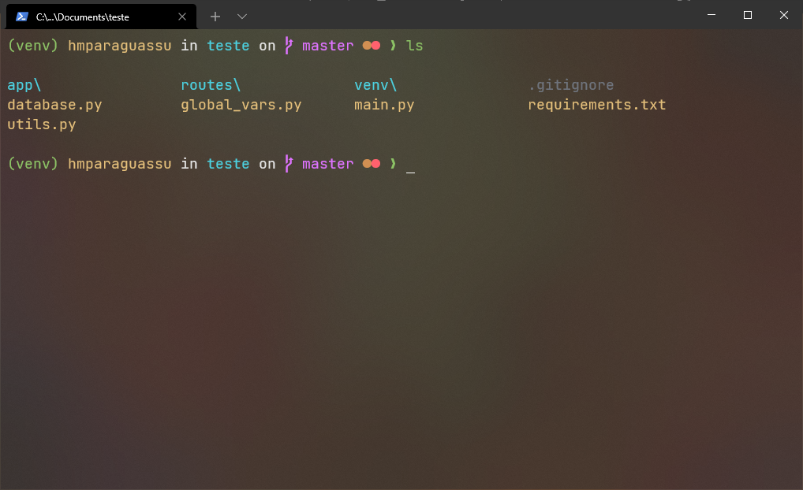

# Meu terminal

Essas são as configurações que uso no meu powershell baseado no terminal do usuario otonii.
Esta versão inclui verificação do ambiente virtual python (virtualenv), e exibe a versão do NodeJS (somente para instâncias criadas com NVS).




## Pré-requisitos

### Terminal

Você precisa utilizar um terminal moderno como o [Hyper](https://hyper.is/) ou [Windows Terminal](https://github.com/microsoft/terminal), eu recomendo o [Windows Terminal](https://github.com/microsoft/terminal) (imagem acima).

### Package Manager

Antes de atualizar o PowerShellGet, você sempre deve instalar o provedor do NuGet mais recente. Em uma sessão do PowerShell com privilégios elevados, execute os comandos a seguir.

```ps1
Install-PackageProvider -Name NuGet -Force
```

Para instalar o PowerShellGet no Windows 10, Windows Server 2016, sistemas com o WMF 5.0 ou 5.1 instalado ou em qualquer sistema com o PowerShell 6, execute os comandos a seguir em uma sessão do PowerShell com privilégios elevados.

```ps1
Install-Module -Name PowerShellGet -Force
```

Ou use o `Update-Module` para obter versões mais recentes.

```ps1
Update-Module -Name PowerShellGet
```

### Liberando a execução de scripts

Eu precisei liberar a execução para ele poder carregar os arquivos de configurações q alguns comando que usaremos a seguir.

```ps1
# Liberar para o usuário atual
Set-ExecutionPolicy -ExecutionPolicy RemoteSigned -Scope CurrentUser

# Ou liberar para todos os usuários (requer privilégios elevados)
Set-ExecutionPolicy -ExecutionPolicy RemoteSigned
```

### Fontes

Pode ser que o seu terminal não reconheça alguns caracteres utilizados para exibir o prompt, por essa razão, recomendo que instale uma fonte como a `Jet Brains Mono` (ou outra Nerd Font) em seu computador.

> [JetBrains Mono](https://www.jetbrains.com/lp/mono/)  
> [Nerd Fonts](https://github.com/ryanoasis/nerd-fonts/releases/)

## Instalação Automática `Beta`

O arquivo `setup.ps1` instala os módulos necessários, copia as pastas de scripts e os arquivos de configurações.

```ps1
# Execute o arquivo de setup no powershell com a linha abaixo
.\setup.ps1
```

## Instalação Manual

### Instalando módulos necessários

```ps1
Install-Module posh-git -Scope CurrentUser
Install-Module -Name PSReadLine -Scope CurrentUser -Force
```

### Criando arquivo $profile

Para habilitar o engine, crie o seu arquivo de perfil do PowerShell

```ps1
# Caso não exista, cria o arquivo
if (!(Test-Path -Path $PROFILE )) { New-Item -Type File -Path $PROFILE -Force }
```

### Copiando arquivos necessários

Copie a pasta `src` para a pasta do arquivo de profile do PowerShell.

```ps
# Você pode encontrar a caminho da pasta e o nome do aquivo executando o comando abaixo no powershell
$profile
```

A estrutura da pasta deve ficar assim:

```
WindowsPowerShell
├── Modules
├── src
└── Microsoft.PowerShell_profile.ps1 (arquivo $profile pode ter outro nome)
```

Agora abra o arquivo `Profile.ps1` e copie o seu conteúdo para o arquivo de profile do PowerShell: `$profile`.

```ps1
# Importando módulos
Import-Module -Name posh-git
Import-Module -Name PSReadLine

Import-Module $PSScriptRoot\src\main.psm1
Import-Module $PSScriptRoot\src\libs\powerls.psm1
Import-Module $PSScriptRoot\src\libs\PowerTouch.psm1

Set-Theme otonii

# Importando configurações do PSReadLine
Import-Module $PSScriptRoot\src\configs\PsReadLineConf.psm1

# Sobrescrevendo a função ls para ficar semelhante à do UNIX
New-Alias -Name ls -Value PowerLS -Option AllScope -Force

# Custom Touch
New-Alias -Name touch -Value PowerTouch -Option AllScope -Force
```

## Prontinho!

Agora o seu PowerShell já está configurado!

---

## Extras

Algumas configurações extras para deixar o terminal ainda mais bacana. (:

### Removendo a mensagem de incio do powershell (Logo)


Para remover essa mensagem (logo) do powershell toda vez que ele for iniciado
basta adicionar a flag `-nologo` na invocação do programa ou adicionar ao
arquivo de profile a propriedade `Clear-Host` logo no começo do arquivo.

#### Estratégia 1 flag `-nologo` (recomendada)

##### Windows Terminal

Abra as configurações do Windows Terminal com a tecla de atalho `ctrl` + `,` e adicione a flag `-nologo` assim:


##### VSCode

No VSCode você deve adicionar a flag na propriedade `args` do objeto `PowerShell` na opção `terminal.integrated.profiles.windows`. Veja no exemplo:

```jsonc
// Terminal
"terminal.integrated.defaultProfile.windows": "PowerShell",
"terminal.integrated.profiles.windows": {
  "PowerShell": {
    "source": "PowerShell",
    "icon": "terminal-powershell",
    "args": ["-nologo"] // nessa linha
  }
}
```

#### Estratégia 2 arquivo `$Profile`

Adicione o comando `Clear-Host` no começo do arquivo, porém, essa estratégia não tem a mesma performance que a flag `-nologo`.

```ps1
# Limpando Console
Clear-Host

# Importando módulos
...
```

### Configurar o Windows Terminal

Essas são as minhas configurações do windows terminal, nela eu faço apenas algumas configurações básicas de aparência. Adicionei também o tema **OneDarkPro** mas você pode alterar o tema pela propriedade `colorScheme` do arquivo de configurações e obter diversos temas na internet.  
> ***Não copie e cole esse trecho no seu arquivo de configurações, pode ser que a sua versão (no futuro) seja diferente da minha e isso gere erros. Configure as propriedades de acordo com sua necessidade e preferência.***

```jsonc
{
  // ...
  "profiles": {
    "defaults": {
      "useAcrylic": true, // Habilita a transparência
      "acrylicOpacity": 0.7, // Define o nível de transparência
      "colorScheme": "OneDarkPro", // Color Scheme
      "cursorShape": "underscore",
      "font": {
        "face": "JetBrains Mono",
        "size": 13
      }
    },
    // ... outras configurações
  },
  // [...]
  "schemes": [
    // [...]
    {
      "name": "OneDarkPro",
      "background": "#282C34",
      "black": "#6F747D",
      "blue": "#4AA5F0",
      "cyan": "#42B3C2",
      "foreground": "#E6E6E6",
      "green": "#8CC265",
      "purple": "#C162DE",
      "red": "#E05561",
      "white": "#D7DAE0",
      "yellow": "#D18F52",
      "brightBlack": "#6F747D",
      "brightBlue": "#4DC4FF",
      "brightCyan": "#4CD1E0",
      "brightGreen": "#8CC265",
      "brightPurple": "#DE73FF",
      "brightRed": "#FF616E",
      "brightWhite": "#E6E6E6",
      "brightYellow": "#E5C07B"
    },
  ]
  // [...]
}
```

### Significado dos *Git Icons*


